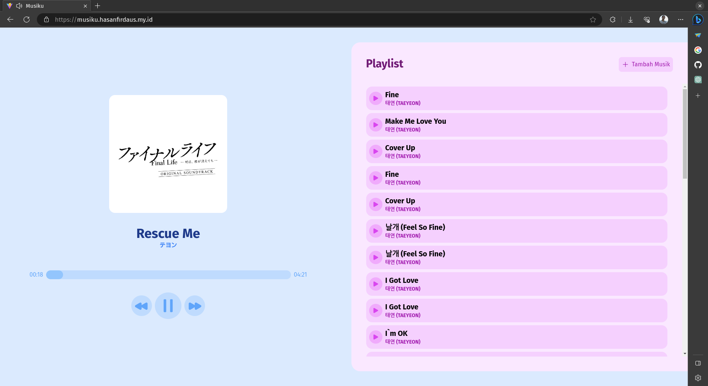

# Musiku

Player musik sederhana dengan menggunakan fitur IndexedDB dari Browser. Dibuat dengan ReactJS, Vite dan TailwindCSS.

Demo: (https://musiku.hasanfirdaus.my.id)[https://musiku.hasanfirdaus.my.id]



## Menjalankan Program

1. Clone Repositori ini:

```shell
git clone https://github.com/hsnfirdaus/musiku.git
```

2. Install dependensi dengan yarn (classic):

```shell
yarn install
```

3. Jalankan development server:

```shell
yarn dev
```

## Hak Cipta

&copy; 2023 Muhammad Hasan Firdaus
